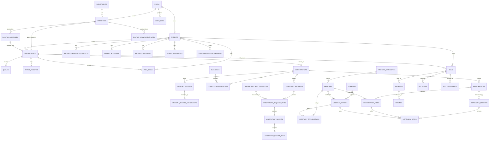

# Entity Relationship Diagram

```mermaid
erDiagram
    USERS ||--o| EMPLOYEES : owns
    USERS ||--o| PATIENTS : owns
    USERS ||--o{ AUDIT_LOGS : performs
    DEPARTMENTS ||--o{ EMPLOYEES : has
    EMPLOYEES ||--o{ DOCTOR_SCHEDULES : doctor_has
    EMPLOYEES ||--o{ DOCTOR_UNAVAILABLE_DATES : doctor_blocks
    EMPLOYEES ||--o{ APPOINTMENTS : doctor_assigned
    PATIENTS ||--o{ PATIENT_EMERGENCY_CONTACTS : has
    PATIENTS ||--o{ PATIENT_ALLERGIES : has
    PATIENTS ||--o{ PATIENT_CONDITIONS : has
    PATIENTS ||--o{ PATIENT_DOCUMENTS : has
    PATIENTS ||--o{ APPOINTMENTS : books
    DOCTOR_SCHEDULES ||--o{ APPOINTMENTS : provides_slot
    APPOINTMENTS ||--o| QUEUES : creates
    APPOINTMENTS ||--o| TRIAGE_RECORDS : has
    PATIENTS ||--o{ VITAL_SIGNS : has
    APPOINTMENTS ||--o{ VITAL_SIGNS : records
    APPOINTMENTS ||--o| CONSULTATIONS : results_in
    CONSULTATIONS ||--o{ MEDICAL_RECORDS : writes
    MEDICAL_RECORDS ||--o{ MEDICAL_RECORD_AMENDMENTS : amended_by
    CONSULTATIONS ||--o{ CONSULTATION_DIAGNOSES : has
    DIAGNOSES ||--o{ CONSULTATION_DIAGNOSES : selected
    CONSULTATIONS ||--o{ LABORATORY_REQUESTS : orders
    LABORATORY_REQUESTS ||--o{ LABORATORY_REQUEST_ITEMS : contains
    LABORATORY_TEST_DEFINITIONS ||--o{ LABORATORY_REQUEST_ITEMS : requested_as
    LABORATORY_REQUEST_ITEMS ||--o| LABORATORY_RESULTS : produces
    LABORATORY_RESULTS ||--o{ LABORATORY_RESULT_ITEMS : contains
    CONSULTATIONS ||--o{ PRESCRIPTIONS : creates
    PRESCRIPTIONS ||--o{ PRESCRIPTION_ITEMS : contains
    MEDICINES ||--o{ PRESCRIPTION_ITEMS : prescribed
    MEDICINE_CATEGORIES ||--o{ MEDICINES : groups
    SUPPLIERS ||--o{ MEDICINE_BATCHES : supplies
    MEDICINES ||--o{ MEDICINE_BATCHES : stocked_in
    MEDICINES ||--o{ INVENTORY_TRANSACTIONS : ledger
    MEDICINE_BATCHES ||--o{ INVENTORY_TRANSACTIONS : affects
    PRESCRIPTIONS ||--o{ DISPENSING_RECORDS : dispensed_by
    DISPENSING_RECORDS ||--o{ DISPENSING_ITEMS : contains
    PRESCRIPTION_ITEMS ||--o{ DISPENSING_ITEMS : fulfills
    MEDICINE_BATCHES ||--o{ DISPENSING_ITEMS : uses
    PATIENTS ||--o{ BILLS : billed
    APPOINTMENTS ||--o{ BILLS : bill_source
    BILLS ||--o{ BILL_ITEMS : contains
    BILLS ||--o{ BILL_ADJUSTMENTS : adjusted_by
    BILLS ||--o{ PAYMENTS : paid_by
    PAYMENTS ||--o{ REFUNDS : refunded_by
    PATIENTS ||--o{ SYMPTOM_CHECKER_SESSIONS : starts
```
