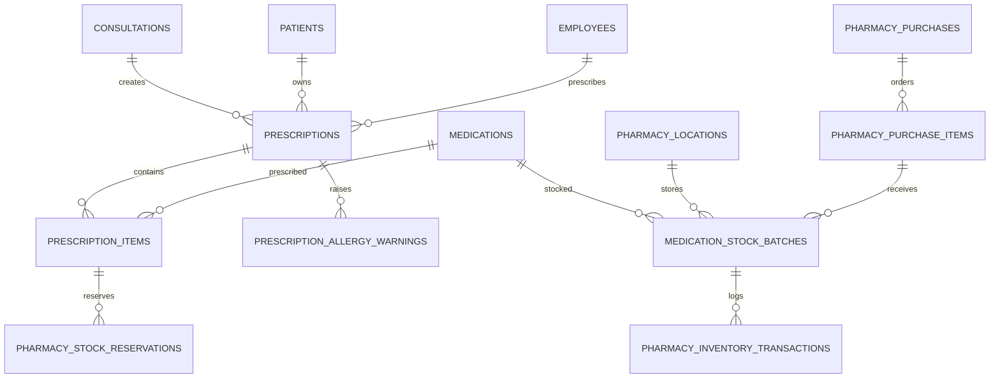

# Entity Relationship Diagram

Phase 10 pharmacy and prescription addition:

```mermaid
erDiagram
    CONSULTATIONS ||--o{ PRESCRIPTIONS : creates
    PATIENTS ||--o{ PRESCRIPTIONS : owns
    EMPLOYEES ||--o{ PRESCRIPTIONS : prescribes
    PRESCRIPTIONS ||--o{ PRESCRIPTION_ITEMS : contains
    MEDICATIONS ||--o{ PRESCRIPTION_ITEMS : prescribed
    PRESCRIPTIONS ||--o{ PRESCRIPTION_ALLERGY_WARNINGS : raises
    MEDICATIONS ||--o{ MEDICATION_STOCK_BATCHES : stocked
    PHARMACY_LOCATIONS ||--o{ MEDICATION_STOCK_BATCHES : stores
    PHARMACY_PURCHASES ||--o{ PHARMACY_PURCHASE_ITEMS : orders
    PHARMACY_PURCHASE_ITEMS ||--o{ MEDICATION_STOCK_BATCHES : receives
    PRESCRIPTION_ITEMS ||--o{ PHARMACY_STOCK_RESERVATIONS : reserves
    MEDICATION_STOCK_BATCHES ||--o{ PHARMACY_INVENTORY_TRANSACTIONS : logs
```

```mermaid
erDiagram
    USERS ||--o| EMPLOYEES : owns
    USERS ||--o| PATIENTS : owns
    USERS ||--o{ AUDIT_LOGS : performs
    DEPARTMENTS ||--o{ EMPLOYEES : has
    EMPLOYEES ||--o| DEPARTMENTS : heads
    EMPLOYEES ||--o{ DOCTOR_SCHEDULES : doctor_has
    EMPLOYEES ||--o{ DOCTOR_SCHEDULE_EXCEPTIONS : doctor_blocks
    EMPLOYEES ||--o{ APPOINTMENTS : doctor_assigned
    PATIENTS ||--o{ PATIENT_EMERGENCY_CONTACTS : has
    PATIENTS ||--o{ PATIENT_ALLERGIES : has
    PATIENTS ||--o{ PATIENT_CONDITIONS : has
    PATIENTS ||--o{ PATIENT_DOCUMENTS : has
    USERS ||--o{ PATIENT_DOCUMENTS : uploads
    USERS ||--o{ PATIENT_ALLERGIES : records
    USERS ||--o{ PATIENT_CONDITIONS : records
    PATIENTS ||--o{ APPOINTMENTS : books
    DOCTOR_SCHEDULES ||--o{ APPOINTMENTS : provides_slot
    APPOINTMENT_TYPES ||--o{ APPOINTMENTS : categorizes
    APPOINTMENTS ||--o{ APPOINTMENT_STATUS_HISTORIES : transitions
    APPOINTMENTS ||--o{ APPOINTMENTS : rescheduled_to
    APPOINTMENTS ||--o| QUEUES : creates
    QUEUES ||--o{ QUEUE_STATUS_HISTORIES : transitions
    QUEUES ||--o| TRIAGE_RECORDS : triaged_by
    QUEUES ||--o{ VITAL_SIGNS : records
    APPOINTMENTS ||--o| TRIAGE_RECORDS : has
    PATIENTS ||--o{ VITAL_SIGNS : has
    APPOINTMENTS ||--o{ VITAL_SIGNS : records
    QUEUES ||--o| CONSULTATIONS : starts
    APPOINTMENTS ||--o| CONSULTATIONS : results_in
    PATIENTS ||--o{ CONSULTATIONS : has
    EMPLOYEES ||--o{ CONSULTATIONS : performs
    CONSULTATIONS ||--o{ CONSULTATION_DIAGNOSES : has
    DIAGNOSIS_CATALOG ||--o{ CONSULTATION_DIAGNOSES : selected
    CONSULTATION_DIAGNOSES ||--o| PATIENT_PROBLEMS : syncs
    PATIENTS ||--o{ PATIENT_PROBLEMS : has
    CONSULTATIONS ||--o{ CONSULTATION_ATTACHMENTS : stores
    CONSULTATIONS ||--o{ MEDICAL_CERTIFICATES : issues
    LABORATORY_TEST_CATEGORIES ||--o{ LABORATORY_TESTS : groups
    SPECIMEN_TYPES ||--o{ LABORATORY_TESTS : required_for
    LABORATORY_TESTS ||--o{ LABORATORY_TEST_COMPONENTS : panel_parent
    LABORATORY_TESTS ||--o{ LABORATORY_REFERENCE_RANGES : ranges
    CONSULTATIONS ||--o{ LABORATORY_REQUESTS : orders
    PATIENTS ||--o{ LABORATORY_REQUESTS : has
    EMPLOYEES ||--o{ LABORATORY_REQUESTS : requests
    LABORATORY_REQUESTS ||--o{ LABORATORY_REQUEST_ITEMS : contains
    LABORATORY_TESTS ||--o{ LABORATORY_REQUEST_ITEMS : snapshotted_as
    LABORATORY_REQUESTS ||--o{ LABORATORY_SPECIMENS : collects
    LABORATORY_SPECIMENS ||--o{ LABORATORY_SPECIMEN_ITEMS : maps
    LABORATORY_REQUEST_ITEMS ||--o{ LABORATORY_SPECIMEN_ITEMS : served_by
    LABORATORY_REQUEST_ITEMS ||--o| LABORATORY_RESULTS : produces
    LABORATORY_RESULTS ||--o{ LABORATORY_RESULT_VERSIONS : amended_by
    LABORATORY_RESULTS ||--o{ LABORATORY_RESULT_ATTACHMENTS : attaches
    LABORATORY_RESULTS ||--o{ LABORATORY_RESULT_ACKNOWLEDGMENTS : acknowledged
    LABORATORY_RESULTS ||--o{ LABORATORY_CRITICAL_RESULT_LOGS : critical_log
    CONSULTATIONS ||--o{ LABORATORY_REQUESTS : orders
    LABORATORY_REQUESTS ||--o{ LABORATORY_REQUEST_ITEMS : contains
    LABORATORY_TEST_DEFINITIONS ||--o{ LABORATORY_REQUEST_ITEMS : requested_as
    LABORATORY_REQUEST_ITEMS ||--o| LABORATORY_RESULTS : produces
    LABORATORY_RESULTS ||--o{ LABORATORY_RESULT_ITEMS : contains
    CONSULTATIONS ||--o{ PRESCRIPTIONS : creates
    PRESCRIPTIONS ||--o{ PRESCRIPTION_ITEMS : contains
    MEDICINES ||--o{ PRESCRIPTION_ITEMS : prescribed
    MEDICINE_CATEGORIES ||--o{ MEDICINES : groups
    SUPPLIERS ||--o{ MEDICINE_BATCHES : supplies
    MEDICINES ||--o{ MEDICINE_BATCHES : stocked_in
    MEDICINES ||--o{ INVENTORY_TRANSACTIONS : ledger
    MEDICINE_BATCHES ||--o{ INVENTORY_TRANSACTIONS : affects
    PRESCRIPTIONS ||--o{ DISPENSING_RECORDS : dispensed_by
    DISPENSING_RECORDS ||--o{ DISPENSING_ITEMS : contains
    PRESCRIPTION_ITEMS ||--o{ DISPENSING_ITEMS : fulfills
    MEDICINE_BATCHES ||--o{ DISPENSING_ITEMS : uses
    PATIENTS ||--o{ BILLS : billed
    APPOINTMENTS ||--o{ BILLS : bill_source
    BILLS ||--o{ BILL_ITEMS : contains
    BILLS ||--o{ BILL_ADJUSTMENTS : adjusted_by
    BILLS ||--o{ PAYMENTS : paid_by
    PAYMENTS ||--o{ REFUNDS : refunded_by
    PATIENTS ||--o{ SYMPTOM_CHECKER_SESSIONS : starts
```
