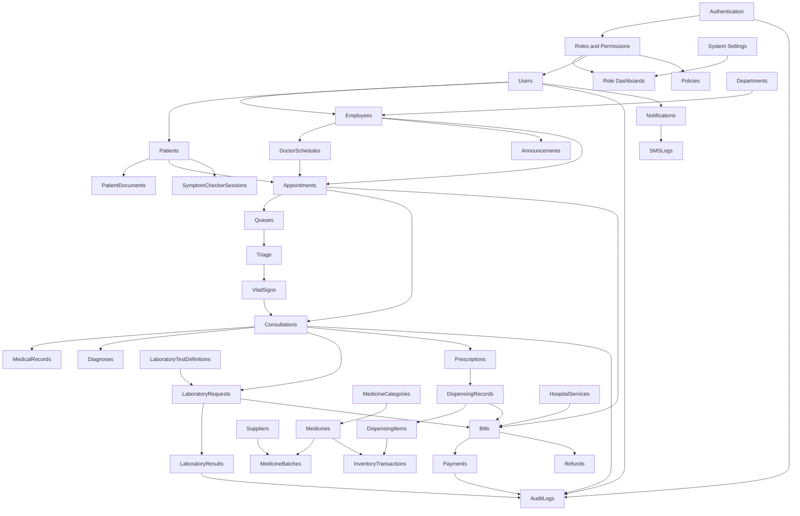

# Module Dependency Plan

## Module Groups

Foundation modules must be completed first because all later modules depend on authentication, roles, permissions, dashboards, settings, and audit logging.

Administrative modules establish hospital structure: departments, employees, user account ownership, services, and announcements.

Patient care modules depend on patients, employees, doctors, schedules, appointments, queues, triage, consultations, diagnoses, and medical records.

Laboratory modules depend on consultations and patients. Results should only release through controlled status transitions.

Pharmacy modules depend on prescriptions and inventory. Dispensing must update dispensing records and inventory transactions atomically.

Financial modules depend on patients and billable events from appointments, laboratory requests, dispensing, and hospital services.

Support modules provide notifications, SMS logs, file handling, symptom checker sessions, reports, and audit logs.

## Mermaid Diagram

## Dependency Rules

- Do not build patient care workflows before roles, permissions, dashboards, departments, employees, and patients exist.
- Do not allow appointments without validated doctor schedules and duplicate-slot checks.
- Do not allow consultation finalization without patient, appointment, doctor, and policy authorization.
- Do not allow laboratory result release without completed request items and audit logging.
- Do not allow medicine dispensing without prescription validation, batch availability, and inventory transaction records.
- Do not allow bill finalization or payment verification without immutable financial audit history.
